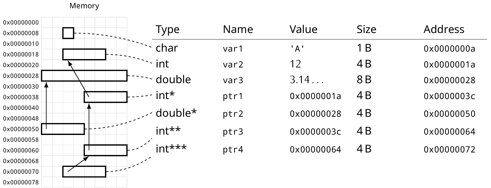

% C Recap
% Alex Hirsch

# About C

## Why C

- **The** system level programming language
- Many OS components still written in C (kernel, subsystems, …)
- Often used under the hood (CPython, GTK, …)
- Used in embedded systems
- Used in security related topics
- Sometimes viewed as lowest common denominator

## Classification

- Procedural
- Statically typed
- Compiled
- Low-level
- No inheritance, no generics, …

# Language

## Primitive Types

```c
char i0;
short i1;
int i2;
long i3;

unsigned char i4;
// …

float f0;
double f1;

int arr1[10];
int arr2[2][3][4];

int *ptr;
void (*fun_ptr)(int);
```

---

```c
#include <stdbool.h>
bool b;

#include <stdint.h>
uint32_t i;

// Increase readability
typedef void (*visit_expression_cb)(struct expression *, void *userdata);

// Don't forget about const!
const int *cptr;
```

## User-defined Types

```c
enum phone_type {
    PHONE_TYPE_HOME,
    PHONE_TYPE_WORK,
};

struct person {
    char name[256];
    int age;
};

union literal {
    int iValue;
    float fValue;
};
```

---

- `enum`s are just `int`s, no additional type checking!
- Prefer `enum`s over pre-processor defines!
  - Additional compile-time checks when used with `switch`
  - Provides debug symbols
- `struct`s are your product types
- `union`s are your sum types
  - Need to keep track of which field is used

---

```
enum.c:13:2: warning: enumeration value ‘PHONE_TYPE_HOME’ not handled in switch [-Wswitch]
```

```
$ gdb ./enum
Breakpoint 1, main () at enum.c:13
13              switch (pt) {
(gdb) print pt
$1 = PHONE_TYPE_HOME
```

## Tagged Unions

```c
enum expression_type {
    EXPRESSION_TYPE_LITERAL,
    EXPRESSION_TYPE_BINARY_OP,
};

struct expression {
    enum expression_type type;

    union data {
        // EXPRESSION_TYPE_LITERAL
        struct literal *literal;

        // EXPRESSION_TYPE_BINARY_OP
        struct binop {
            enum binary_op op;
            struct expression *lhs;
            struct expression *rhs;
        };
    };
};
```

## Initialisation

```c
int truth = 42;
int *ptr = NULL;

int arr1[] = {1, 2, 3, [10] = 50};

int arr2[][3] = { {1, 2, 3},
                  {2, 3, 4} };

struct point p1 = {
    .x = 1.2,
    .y = 2.3,
};
```

- Always initialise variables!

## Compound Literals

```c
struct point p1;

// …

p1 = (struct point){ .x = 1.2, .y = 2.3 };
```

## Short-circuit Evaluation

```c
if (foo() || bar() || baz()) {
    // Do something
}
```

---

```c
if (pWidget && pWidget->visible) {
    render(pWidget);
}
```

## Control-flow Statements

```c
if (condition) {
    foo();
} else {
    bar();
}

while (condition) {
    foo();
}

do {
    foo();
} while (condition);
```

---

```c
for (int i = 0; i < size; i++) {
    if (i % 2 == 0) {
        continue;
    }

    if (i > 128) {
        break;
    }

    baz(i);
}
```

- Since C99 we can declare variables inside `for`, use this!
- Avoid complex `continue` / `break` behaviours

---

```c
switch (pt) {
case PHONE_TYPE_WORK:
    puts("work");
    break;
default:
    puts("default");
    break;
}
```

- Avoid `default` when using `enum`s so you get a warning
- Use `// fall-through` to suppress warnings if needed

## Functions

- Your bread 'n' butter in C
- Should be short and sweet, and do only **one** thing
- The signature should tell the function's purpose
- Functions need to be declared before they can be used
  - Definition also declares a function

---

```c
double square(double n);

bool is_prime(int n);

int sum(const int *data, int size);

double clamp(double value, double lower, double upper);

double xfb(int a, int b, double pre); // 🤔
```

---

- Functions should touch as little global state as possible
- Ideally functions should be *pure*
- Always use `const` if pointers are used for input
- Pointers are also commonly used for output parameters (no `const`)

## Pointers


---


---


---


---


---



---

- Pointers are an essential language feature in C
- Used for working with large *objects*
- Underlying building block for arrays
- Enable the use of output parameters
- Enable efficient implementation of algorithms and data structures
- `NULL` often used to indicate absence or error

## Arrays

- Multiple values of the same type consecutive in memory
- Need to keep track of the size
- No bounds checking
- Commonly used for buffers and strings

---

```c
int arr[10];

arr[5] ⟺ *(arr + 5)
```

- `arr` behaves like a pointer
- Offsetting the pointer automatically takes element size into account

---

```c
#define ARRAY_SIZE(arr) (sizeof(arr) / sizeof(arr[0]))

int arr[10];
printf("%ld\n", ARRAY_SIZE(arr)); // output: 10

void fun(int arr[10])
{
    printf("%ld\n", ARRAY_SIZE(arr)); // output: 2
}
```

- Be careful about array-to-pointer decay
- Always keep track of the size
- Additional parameter information completely ignored by compiler

## Strings

- String literals (e.g. `"foo"`) are immutable
  - Typically handled as `const char *`
- Strings are NULL-terminated!
- Be careful when using string related functions!
- Consider using `asprintf` for any kind of string interpolation
  - Alternative use `snprintf`
- Always prefer bounds checking functions (e.g. `strncpy`) over their naïve variants (e.g. `strcpy`)

## Assertions

```c
struct expression *expression_binary_op(enumbinary_op op,
                                        struct expression *lhs,
                                        struct expression *rhs)
{
    assert(lhs);
    assert(rhs);

    // …
}
```

---

- Make good use of `assert`!
- Commonly used to check pre-conditions
- Typically disabled in *release* builds
- No substitution for regular error checking!
  - Assertions are meant to catch programmer errors

## `goto`

```c
for (int i = 0; i < 10; ++i) {
    for (int j = 0; j < 20; ++j) {
        if (j == 10) {
            goto loopexit;
        }
        printf("(%d,%d) ", i, j);
    }
    printf("\n\n");
}
loopexit:
```

---

```c
char *buffer = malloc(256);

for (int i = 0; i < numberOfThings; i++) {
    if (giveMeThing(i, buffer) != OK)
        goto error;
    if (processThing(buffer) != OK)
        goto error;
    if (dispatchThing(i, buffer) != OK)
        goto error;
}

free(buffer);
return OK;

error:
free(buffer);
return OOPS;
```

## Multiple Source Files

- Header-files define types and declare functions
- Source-files contain the implementation
- Prefix internal functions with `static`
  - Prevents symbol conflicts between translation units
  - Communicates that the function is an implementation detail

More about this later…

## Miscellaneous

- Bitfields
- Ternary operator
- `offsetof`
- `extern`
- …

# Memory

## Stack

- Managed by the program itself (no need to touch it)
- Used for function call book-keeping
- Contains local variables
- Can be observed during debugging

---


## Heap

- Used for dynamic memory allocations
- Managed by the programmer through standard library functions
  - `malloc` / `free`
- Common source of memory corruption bugs
  - Use-after-free

## Text

- Contains program code
- Typically not writeable

## Data Segments

- `.rodata`
  - Contains initialized global / static variables
  - Read-only
- `.data`
  - Contains initialized global / static variables
  - Writable
- `.bss`
  - Contains uninitialized global / static variables
  - Zero initialized
  - Writable

# Resource Management

## Examples

```c
int *buf = malloc(256 * sizeof(int));
free(buf);

FILE* in = fopen("input.txt");
fclose(in);

pthread_mutex_lock(&mutex);
pthread_mutex_unlock(&mutex);
```

---

- Manual acquisition and release via functions (or macros)
- Common source of errors
- No dedicated language feature to deal with this
- `goto` can be used to prevent code duplication

## Lifetime

- Critical think about when resources are acquired and released
- Clearly defined lifetime lessens the likelihood of bugs
- Core principle of software architecture

## Ownership

- Who (which part of the program) acquires and releases a resource
- Ideally a single owner per resource
- Multiple owners need to coordinate with each other (e.g. reference counting)
- Clearly indicate transfer of ownership between parts of the program

More about this later in C++…

# Pre-processor

## Overview

- Essential part of the C language
- Can be used to build obscure mechanisms (black magic)
- Techniques for minimising code duplication

## Includes

```c
#include <stdio.h>
```

## Defines

```c
#define CLAMP(x,low,heigh) (((x) > (high)) ? (high) : (((x) < (low)) ? (low) : (x)))
```

```c
#define FOO \
    do { \
        do_stuff(); \
        do_other_stuff(); \
    } while (0)
```

## Header Guards

```c
#ifndef SOME_HEADER_H
#define SOME_HEADER_H

#endif
```

## Conditional Compilation

```c
#ifdef _DEBUG

#else

#endif
```

## Expansion

```c
#define XSTR(x) STR(x)
#define STR(x) #x

#define MAKE_VERSION(major, minor, patch) "v" XSTR(major) "." XSTR(minor) "." XSTR(patch)
```

```c
#define VERSION_MAJOR 0
#define VERSION_MINOR 1
#define VERSION_PATCH 0

#define VERSION MAKE_VERSION(VERSION_MAJOR, VERSION_MINOR, VERSION_PATCH)
```

## X-Macros

```c
CONFIG(int, width, 1920)
CONFIG(int, height, 1080)
CONFIG(double, effectVolume, 1.0)
CONFIG(double, musicVolume, 0.3)

#undef CONFIG
```

```c++
struct config {
    #define CONFIG(_type, _identifier, _default) _type _identifier = _default;
    #include "config.def"
};
```

# Exercises

## Conway's Game of Life

- Focus on a clean and readable implementation
- Read field size, starting population, and number of iterations from command-line parameters
- Save each *frame* as PBM image

## Doubly Linked List

- A classic
- Use `void *` so it can be used with arbitrary types
- Investigate the concept of *intrusive* linked lists

## Reading Material

- Your favourite C tutorial
- Read up on common C standard library functions
- Man-pages
- SEI CERT C Coding Standard
- Revisit operating system lecture on libraries
