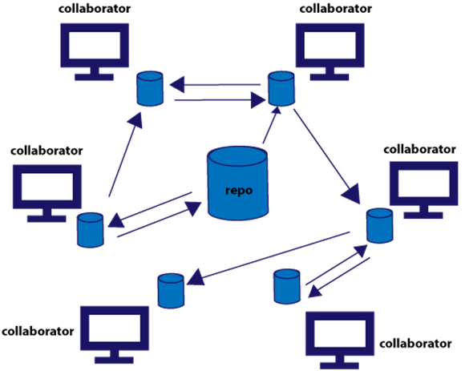
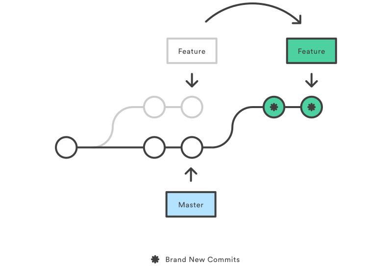
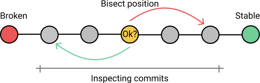
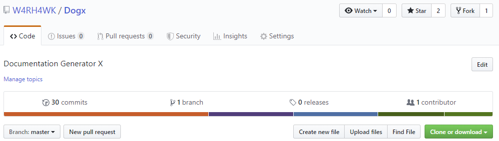
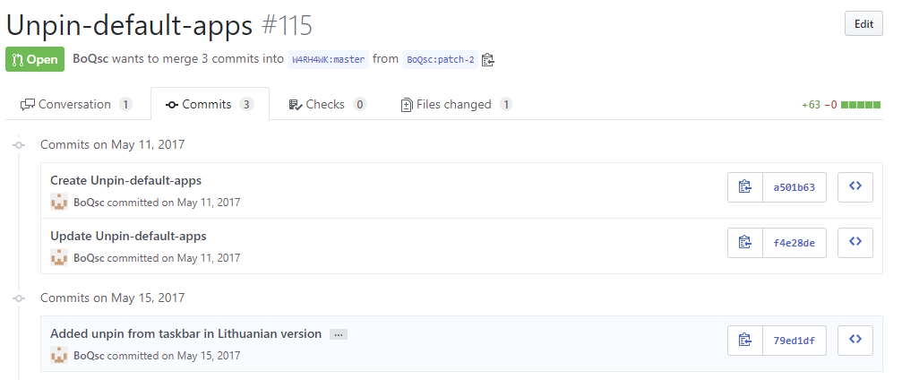
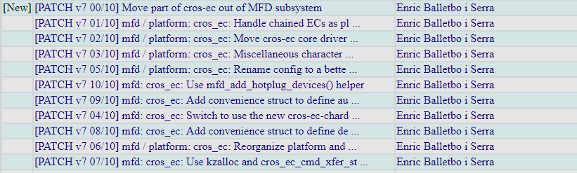
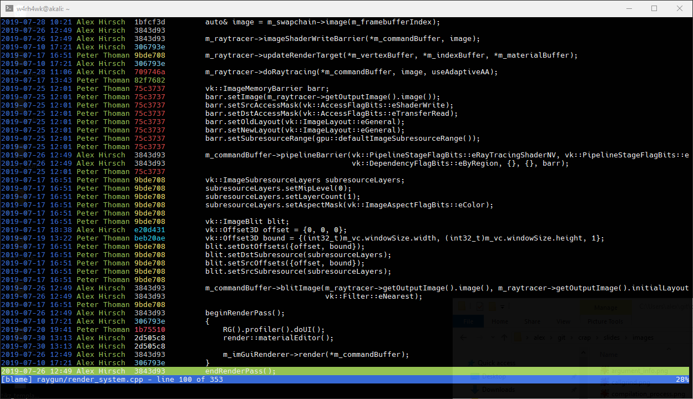

% Git
% Alex Hirsch

# Overview

## About Git

- Version Control System
- Distributed
- High performance (Linux Kernel)
- Very flexible
- Complicated command-line interface
- Scriptable

## Distributed

## GUIs / TUIs

- Your IDE
- gitk
- gitg
- GitKraken
- Fork
- Magit (Emacs) / Fugitive (Vim)
- tig
- …

## Terminology 1

Repository (Repo)
  ~ Folder that stores all of the project's (tracked) content (including past).

Working Tree
  ~ Folder containing the *current version* of the project.

---

Commit
  ~ A *snapshot* of the project.

Diff
  ~ The delta between two commits.

# Getting Started

    $ git init /tmp/foo
    Initialized empty Git repository in /tmp/foo/.git/

    $ ls -la /tmp/foo
    drwxr-xr-x 1 alex alex 512 Sep  2 09:47 .         ⟵ Working Tree
    drwxrwxrwt 1 root root 512 Sep  2 09:47 ..
    drwxr-xr-x 1 alex alex 512 Sep  2 09:47 .git      ⟵ Repository

---

    $ echo 'This is my first repostiory' > README

    $ git status
    On branch master

    No commits yet

    Untracked files:
      (use "git add <file>..." to include in what will be committed)

            README

    nothing added to commit but untracked files present (use "git add" to track)

---

    $ git add README

    $ git status --short
    A  README

---

    $ git commit -m 'First commit'
    [master (root-commit) 90d9457] First commit
    1 file changed, 1 insertion(+)
    create mode 100644 README

---

    $ git status
    On branch master
    nothing to commit, working tree clean

---

    $ git log
    commit 90d94574e5697166d096fe2ab0b54773625de73e    ⟵ Commit Hash
    Author: Alex Hirsch <alex@dps.uibk.ac.at>
    Date:   Mon Sep 2 09:52:11 2019 +0200

        First commit

---

    $ echo 'Another line' >> README

    $ git status --short
     M README

    $ git commit -am 'Another commit'
    [master 4a3252c] Another commit
    1 file changed, 1 insertion(+)

---

    $ git log --oneline
    4a3252c (HEAD -> master) Another commit
    90d9457 First commit

---

    $ git show 90d9457
    commit 90d94574e5697166d096fe2ab0b54773625de73e
    Author: Alex Hirsch <alex@dps.uibk.ac.at>
    Date:   Mon Sep 2 09:52:11 2019 +0200

        First commit

    diff --git a/README b/README
    new file mode 100644
    index 0000000..272d1dd
    --- /dev/null
    +++ b/README
    @@ -0,0 +1 @@
    +This is my first repostiory

---

    $ cat README
    This is my first repostiory
    Another line

    $ git checkout 90d9457
    […]

    $ cat README
    This is my first repostiory

## Terminology 2

Checkout
  ~ Set the Working Tree to the state of a specific commit.

Staging
  ~ Files / changes that are to be committed.

`HEAD`
  ~ Reference to the last commit in the currently check-out branch.

## Branches

## Merges

---

## Merge Conflict

    If you have questions, please
    <<<<<<< HEAD
    open an issue
    =======
    ask your question in IRC.
    >>>>>>> branch-a

# Collaborating

## Terminology 3

Remote
  ~ Another place of the same repository.

Clone
  ~ Grabbing the wanted repository from a remote.

Origin
  ~ The remote you got the repository from.

---

Push
  ~ Copy commits from local to remote.

Fetch / Pull
  ~ Copy commits from remote to local.

## Remote Example

    $ git clone /tmp/foo /tmp/bar
    Cloning into '/tmp/bar'...
    done.

    $ ls -la /tmp/bar
    total 0
    drwxr-xr-x 1 alex alex 512 Sep  2 10:53 .
    drwxrwxrwt 1 root root 512 Sep  2 10:53 ..
    drwxr-xr-x 1 alex alex 512 Sep  2 10:53 .git
    -rw-r--r-- 1 alex alex  41 Sep  2 10:53 README

---

    $ cd /tmp/bar/

    $ git remote -v
    origin  /tmp/foo (fetch)
    origin  /tmp/foo (push)

---

    $ cat README
    This is my first repostiory
    Another line

    $ echo 'Yet another line' >> README

    $ git commit -am 'Our third commit'
    [master c754a65] Our third commit
     1 file changed, 1 insertion(+)

---

    $ git push
    Counting objects: 3, done.
    Delta compression using up to 8 threads.
    Compressing objects: 100% (2/2), done.
    Writing objects: 100% (3/3), 295 bytes | 295.00 KiB/s, done.
    Total 3 (delta 0), reused 0 (delta 0)
    To /tmp/foo
       4a3252c..c754a65  master -> master

---

    $ cd /tmp/foo

    $ git config --local receive.denyCurrentBranch updateInstead

- Pushing to *non-bare* repository was enabled for this example.
- Only used for demonstration purposes, use bare repositories.

---

    $ cd /tmp/foo

    $ git log --graph --oneline
    * c754a65 (HEAD -> master) Our third commit
    * 4a3252c Another commit
    * 90d9457 First commit

# Rebase

## Rebase vs. Merge

---

## But, why?

- Linear history
- Merge commits sometimes considered *noise*

## Bisect

## When to Rebase?

- Only use rebase locally
- Use rebase for small features
- Use `git pull --rebase` instead of `git pull`

# Workflows

## Master vs. Dev Branch

---

- Code inside `master` branch is stable
- Utilise *tags*
- Content flows from `dev` branch to `master` branch

## Feature Branches

---

- Use dedicated branches for implementing new features
- Locally rebase feature branch until ready for final merge

## Release Branches

- Useful for versioned releases
- Use dedicated branch per release
- Easy to add hotfixes
  - Fix that needs to be put out quickly,
  - but only added to the `dev` branch later on

## Forking

---

---

---

- Typically used with GitHub / GitLab / Bitbucket / …
- Does scale very well
- Often seen as the *modern* way of using Git

## Email

- Sending patches via mail
  - `git format-path` / `git send-mail`
- Add received patches
  - `git apply` / `git am`
- Used by Linux kernel
- Feels old, works fine
- No need for additional software like GitLab

---

# Miscellaneous

## Aliases

    [alias]
        c = checkout
        co = commit
        d = diff
        ds = diff --staged
        l = log --all --graph --oneline --decorate
        s = status --short --branch
        ff = merge --ff-only
        puff = pull --ff-only
        purr = pull --rebase
        mnc = merge --no-ff --no-commit

## Blame

## Custom Diff- / Merge-tools

    [merge "unityyamlmerge"]
        tool = unityyamlmerge
        driver = '/mnt/c/Program Files/Unity/Hub/Editor/2018.3.9f1/Editor/Data/Tools/UnityYAMLMerge.exe' merge -p %O %B %A %P
    [mergetool "unityyamlmerge"]
        trustExitCode = false
        cmd = '/mnt/c/Program Files/Unity/Hub/Editor/2018.3.9f1/Editor/Data/Tools/UnityYAMLMerge.exe' merge -p \"$BASE\" \"$REMOTE\" \"$LOCAL\" \"$MERGED\"

## Using SSH

- Please always use SSH with public / private key

## Storing Large Files

- Git Large File Storage (LFS)
- Git Annex

## Bash Prompt

- Don't overdo it, may slow down your shell

# Exercises

## Try Git with other People

- Get a couple of friends
- Do a small programming exercise that can be divided
- Use any workflow (or combination) mentioned
- Talk to each other while doing the exercise

## Reading Material

- Bitbucket / GitHub documentation
- Git Book
- Your favourite Git tutorial
- Man-pages (!)
