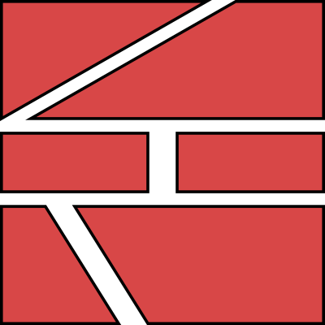

% Techniques
% Alex Hirsch

# Planning

## Meet the Problem

## Analysis

- Understand the problem
- Relation to similar problems
- Existing solutions

## Dissecting

- Break a big problem into smaller problems
- Often pieces share similarities
- `goto Analysis`

---

---

## Problem Description

- Document fully describing the problem
- Mentions every detail discovered
- Result of your analysis process

## Solution

- Start with the big picture
  - Block diagrams
  - UML
- Define modules
  - Purpose
  - What to cover
- Define module interaction
  - Interfaces between modules

---

- Go through each module
  - Critically think about its tasks
  - How can it be realised?
  - What problems could emerge?
  - How does data flow through this module?

## Solution Specification

- Document fully describing the solution
- May contain lots of details
- Needs to communicate the big picture
- Consider it a guide for implementing

## Manging Time

- Split the implementation work into small, manageable tasks
- Critically think about relation ships between tasks
  - Does feature A depend on feature B?
- Consider which resources are needed for each task
  - Do we need special equipment?
  - Who will work on this?
- *Maybe* add time estimates to tasks

## Gantt Chart

## Iterating

- Problem changes over time
- Solution has shortcomings
- Resource situation changes

---

- Update problem description
- Make changes to your solution specification
- Update your management plane accordingly
- Flexibility is paramount

This commonly decides between success and failure.

# Software Architecture

## Modules

- Each module should fulfil a specific purpose
  - *Separation of Concerns*
- Modules interact with each other to achieve greater tasks
  - Interface of a module
  - Module dependencies
  - Level of abstraction (high-level vs. low-level)

## Interfaces

- Multiple components need to work together
- Smaller interfaces provide more flexibility
  - *Loose coupling*
- Need to be clearly defined
- Should be free from implementation details

## Abstractions

If things get to complicated, adding another layer may help.

---

---

---

- Sometimes introduces more code
  - Ensure trade-off is worth it
- Details become less obvious
  - The devil is in the detail
- Think in layers
  - How far am I from the lowest level

> You aren't gonna need it

## Cross Layer Interaction

