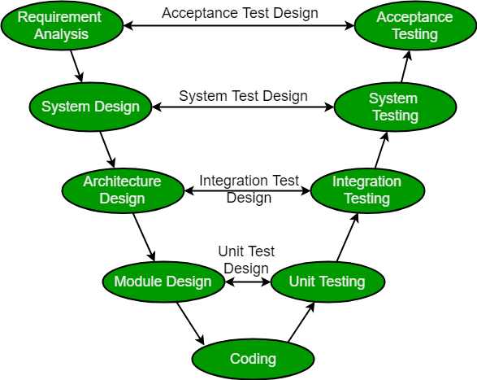

% Techniques
% Alex Hirsch

# Planning

## Meet the Problem


## Analysis

- Understand the problem
- Relation to similar problems
- Existing solutions

## Dissecting

- Break a big problem into smaller problems
- Often pieces share similarities
- `goto Analysis`

---


---


## Problem Description

- Document fully describing the problem
- Mentions every detail discovered
- Result of your analysis process

## Solution

- Start with the big picture
  - Block diagrams
  - UML
- Define modules
  - Purpose
  - What to cover
- Define module interaction
  - Interfaces between modules

---

- Go through each module
  - Critically think about its tasks
  - How can it be realised?
  - What problems could emerge?
  - How does data flow through this module?

## Solution Specification

- Document fully describing the solution
- May contain lots of details
- Needs to communicate the big picture
- Consider it a guide for implementing

## Manging Time

- Split the implementation work into small, manageable tasks
- Critically think about relation ships between tasks
  - Does feature A depend on feature B?
- Consider which resources are needed for each task
  - Do we need special equipment?
  - Who will work on this?
- *Maybe* add time estimates to tasks

## Gantt Chart


## Iterating

- Problem changes over time
- Solution has shortcomings
- Resource situation changes

Core idea behind *agile* software development.

---

Stay away from *scrum* and a like, it's probably a big scam.

---

- Update problem description
- Make changes to your solution specification
- Update your management plane accordingly
- Flexibility is paramount

This commonly decides between success and failure.

# Software Architecture

## Modules

- Each module should fulfil a specific purpose
  - *Separation of Concerns*
- Modules interact with each other to achieve greater tasks
  - Interface of a module
  - Module dependencies
  - Level of abstraction (high-level vs. low-level)

## Interfaces

- Multiple components need to work together
- Smaller interfaces provide more flexibility
  - *Loose coupling*
- Need to be clearly defined
- Should be free from implementation details

## Abstractions

If things get to complicated, adding another layer may help.

---


---


---

- Sometimes introduces more code
  - Ensure trade-off is worth it
- Details become less obvious
  - The devil is in the detail
- Think in layers
  - How far am I from the lowest level?

> You aren't gonna need it!

## Cross Layer Interaction


# Implementation

## Types

- Types are documentation
- Use meaningful types (e.g. `bool`)
- Use structs / class to group data that belongs together (e.g. `User`)

## Functions

```c
double square(double n);

bool is_prime(int n);

int sum(const int *data, int size);

double clamp(double value, double lower, double upper);

double xfb(int a, int b, double pre); // 🤔
```

---

- Signatures are documentation
- `const` pointers signal input, non-`const` pointers signal output
- If signature gets too complex
  - Use a struct for parameters / return value
  - Split function, would be too complicated anyway

---

- Which global state does the function touch?
- Observe the call-graph
  - Which parts of the program calls this function?
  - Which functions are called by this function?
- Which layer of abstraction are we on?

---

- Number of local variables should not exceed 7
- How long is the function?
- How complicated is the control-flow?

## Variables

- Again, use the correct type
- Meaningful name, don't abbreviate (e.g. `wnd` vs. `window`)
  - Conventional abbreviations are ok (e.g. `num_users`)
- `const` by default
- Always initialise
- Limit their scope
  - Manually
  - Utilise variable declaration inside `for` (and `if` since C++17)

---

```c
int main(void)
{
    int number1, number2, number3,
        difference1, difference2, difference3,
        larger_numbers, smallest_difference,
        secret_number, winner;
    // …
}
```

Bad

---

```c
int main(void)
{
    srand(time(NULL));
    int secret = rand() % 100;

    while (true) {
      int guess1 = get_guess();
      int guess2 = get_guess();
      int guess3 = get_guess();

      // …
    }
}
```

Good

---

```c++
const auto direction = physx::PxVec3(inputDir.x, 0.f, inputDir.y)
const auto strength = 2000.0 * timeDelta;

entity->addTorque(strength * direction, physx::PxForceMode::eIMPULSE);

// …
```

Bad

---

```c++
{
    const auto direction = physx::PxVec3(inputDir.x, 0.f, inputDir.y)
    const auto strength = 2000.0 * timeDelta;

    entity->addTorque(strength * direction, physx::PxForceMode::eIMPULSE);
}

// …
```

Good

## Control-Flow

- Linearize as much as possible
- Limit nesting depth
- Avoid complex `break` / `continue` constructs
- Avoid conditionals / loops inside `switch`
- Use empty lines to separate blocks that belong together

Use additional functions (or macros) if things get too complex.

---

```c
void foo(void)
{
    if (first()) {
        if (second()) {
            if (third()) {
                // …
            }
        }
    }
}
```

Bad

---

```c
void foo(void)
{
    if (!first())
      return;

    if (!second())
      return;

    if (!third())
      return;

    // …
}
```

Good

## Comments

- Comments should tell **why** something is happening
- Code should tell **what** is happening
- Do not introduce comments where none are necessary
- Consider overview comments at the beginning of files
  - Keep them free of implementation details

Avoid comments that need to be kept in sync with other parts of the code.

---

```c++
double Engine::updateTimestamp()
{
    const auto now = Clock::now();

    auto delta = now - m_timestampe;
    m_timestampe = now;

    // cap delta to 100 milliseconds
    delta = std::min<Clock::duration>(delta, 50ms);

    // …
}
```

Bad

---

```c++
double Engine::updateTimestamp()
{
    const auto now = Clock::now();

    auto delta = now - m_timestampe;
    m_timestampe = now;

    // Large time deltas can cause issues with physics simulations. Capping it
    // here affects the whole simulation (not just physics) equally.
    delta = std::min<Clock::duration>(delta, 50ms);

    // …
}
```

Good

## Classes

- Put together what belongs together (data and functions)
  - Adhere to separation of concerns
- Cleary communicate invariants
- Interfaces much bigger than your regular functions
  - Make sure this trade-off is worth it!
  - Limit the number of public methods (and variables)
- Critically think about the lifetime (and ownership) of instances
- Try to minimize mutability of held data
- Auto-generate getters / equality / hash / … **at compile-time**

---

```haskell
data Person = Person { firstName :: String
                     , lastName  :: String
                     , age       :: Int
                     }
  deriving (Eq, Ord, Show, Read)

main = print $ Person "John" "Doe" 28
```

```
Person {firstName = "John", lastName = "Doe", age = 28}
```

# Testing

## V-Model



## How to write useful tests?

- Start with unit testing
- Focus on black-box testing
- Focus on testing complex logic
- Test error cases (negative tests)
- Observe test coverage
- Add integration tests

Consider test driven development (TDD).

---

- Use a testing framework
- Integrate it into the build system
- Make it easy to write and run tests!
  - See Go for instance

---

```
make         # builds the project

make test    # runs all unit tests

scripts/run_integration tests
```

---

)

## Continuous Integration

- Let services (Jenkins, GitLab CI) build and test your code
- Reject merge-requests which break tests
- View this as a form of quality assurance

---


---


---


---


---


# Profiling

## About Profiling

- Not that important right now
- Always measure!
  - Are the values you measure meaningful?!
  - Related multiple measurements over time
- Can be applied to multiple layers
  - Micro-benchmarks (similar to unit tests)
  - Overall benchmark
- Profile **release** builds!

---


---


---

- Correctly present plots
  - Labelled axes
  - Grid lines
  - Print data points (no need to connect them)
  - Put some reference there
  - Use a suitable scale
  - Consider logarithmic axes

# Debugging

## How to debug

- Investigate the symptoms
- Use your brain!
  - Are they expected?
  - What could cause these symptoms?
- Formulate hypothesis
  - Try to **dis-**prove it!
  - Narrow the scope of it
  - Immediately test assumptions

## Dealing with Segfaults

- Use your brain!
  - Disprove hypothesis
  - Use different configurations (optimisation level)
- Are there compiler warnings?
- Does Valgrind show issues?
- Run in GDB, observe stack trace
  - Examine local variables / parameters
  - Investigate other stack frames `up` / `down`
  - Symptom ≠ cause
- Investigate lifetime and ownership of related objects

⟶ Bug description

---

- Create a dedicated test
  - Will fail at the moment
- Solve the issue
  - Test should now be successful
  - Did I break anything?
- Commit your fix
