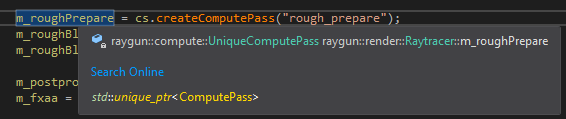
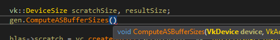
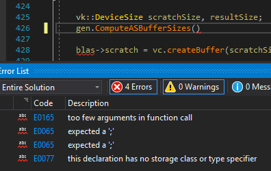
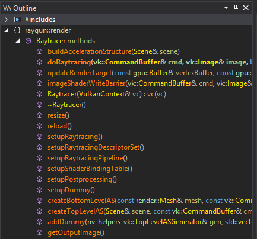
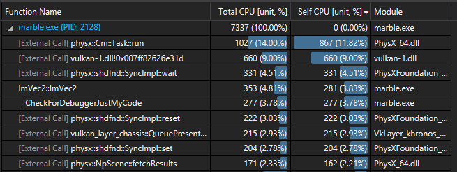
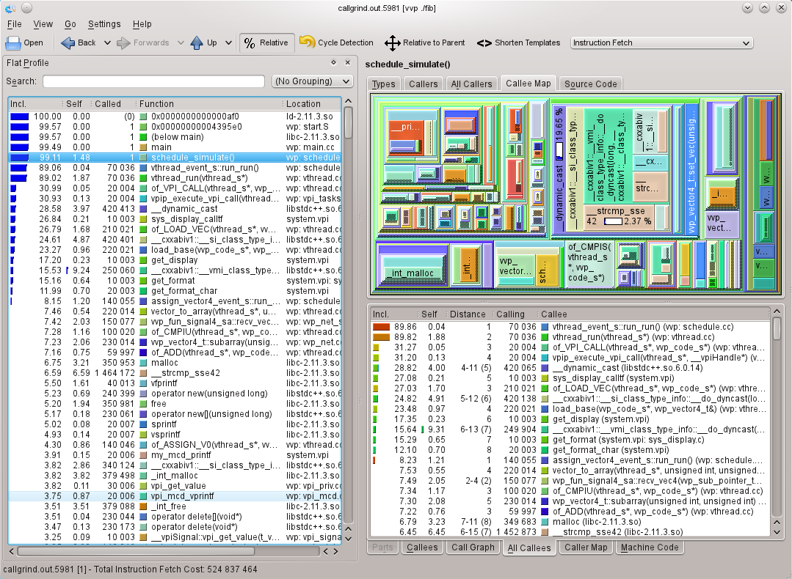
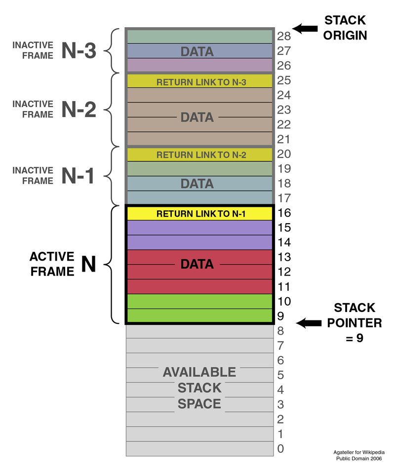
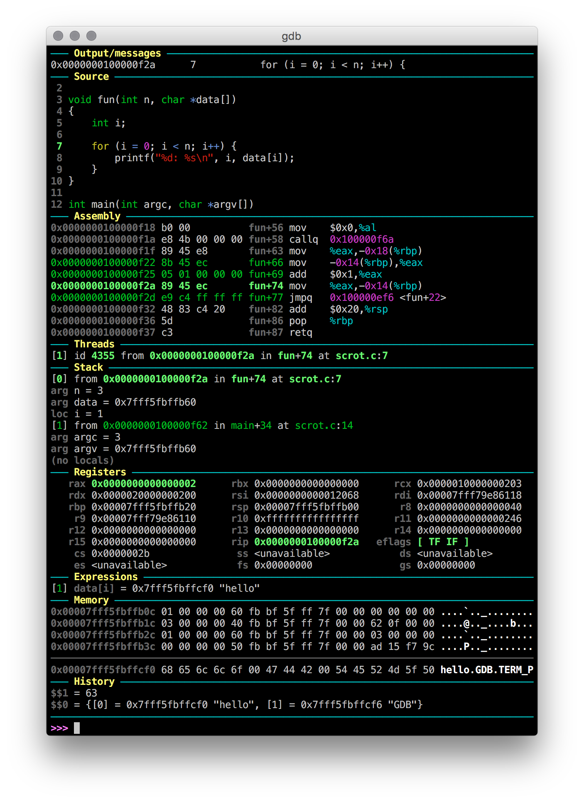
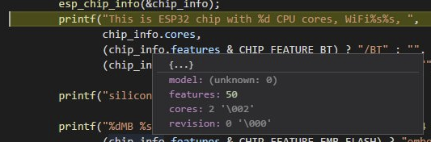

% Tools
% Alex Hirsch

# Text editor / IDE

## Lots of Options

- Nano / Notepad
- Vim / Emacs
- VSCode / Atom / Sublime Text / …
- CLion / Eclipse / Qt Creator / …
- Visual Studio

## What's Important

- Being productive
  - Auto-completion
  - Go to definition
  - Debugger integration
- Ergonomics
  - Snippets
    - `ms` ⟶ `std::make_shared<T>(args)`
  - Multi-cursor
  - Forward / backward like in your browser
  - Quickly switch between header / source file

---



---



---



## 80% / 19% / 1%

- 80% (e.g. Visual Studio)
  - Prefer ergonomics
  - Optimise your workflow
- 19% (e.g. VSCode)
  - Cover multiple languages
  - Good out-of-the-box experience
  - Use something that's mainstream
- 1% (e.g. Vim)
  - Feature rich
  - Macro support
  - Can be scripted
  - Can be used inside a terminal (over SSH)

## Code Navigation

- Use your IDE
- `grep` / Silver Searcher / ripgrep
- Ctags / GNU Global / rtags
- Language servers (cquery, Clangd)

---



# Compiler

## Configurations

- Always enable warnings (`-Wall -Wextra -pedantic`)
  - There are even more!
  - Try to have as few warnings as possible
  - Suppress them in special cases
- Debug vs. release build:
  - Optimisations disabled / enabled
  - Assertions enabled / disabled
  - Debug symbols enabled / disabled

## Phases


# Build System

## Advanced Build System

- CMake (industry standard for C++)
- Autotools
- SCons
- Meson
- MSBuild
- …

## Make

- Comparatively simple
- Can be used for various different tasks / languages
- Suitable for small projects consisting of a few source files
- Checks timestamps for outdated targets
- Convention: first target is built by default (typically called `all`)
- Pitfall: tab required for indentation

---

```
<target>: <dependencies>
	<command>
	<command>
	…
```

```make
example: example.c other.c
	gcc -Wall -Wextra -o example example.c other.c
```

---

Using *special variables* `$@` and `$^` to prevent duplication and allow for patterns.

```make
example: example.c other.c
	gcc -Wall -Wextra -o $@ $^
```

---

- Use conventional variables (`CC`, `CFLAGS`, …)
- These variables are often initialized by Make

```make
CFLAGS = -Wall -Wextra

example: example.c other.c
	$(CC) $(CFLAGS) -o $@ $^
```

---

- Utilize Make's implicit rules
  - Pattern matching on target and dependencies

```make
CFLAGS = -Wall -Wextra

example: example.c other.c
```

```
$ make
cc -Wall -Wextra    example.c other.c   -o example
```

---

- Use object files
  - Intermediate files, speeds up rebuilding

```make
CFLAGS = -Wall -Wextra

example: example.o other.o
```

```
$ make
cc -Wall -Wextra   -c -o example.o example.c    # compilation of example
cc -Wall -Wextra   -c -o other.o other.c        # compilation of other
cc   example.o other.o   -o example             # linking
```

---

- First (default) target should be `all`
- `clean` target should be present

```make
CFLAGS = -Wall -Wextra

all: example

clean:
	$(RM) example example.o other.o

example: example.c other.c
```

```
$ make all
cc -Wall -Wextra   -c -o example.o example.c
cc -Wall -Wextra   -c -o other.o other.c
cc   example.o other.o   -o example

$ make clean
rm -f example example.o other.o
```

---

Pattern matching example:

```make
# …

%.html: %.md
	$(PAN) $(PANFLAGS) $(PANFLAGS_DOC) -o $@ $^

%.pdf: %.html
	$(HTMLTOPDF) $(HTMLTOPDFFLAGS) --print-to-pdf=$@ "file://$(WD)/$<?print-pdf"

%_slides.html: %_slides.md
	$(PAN) $(PANFLAGS) $(PANFLAGS_SLIDES) -o $@ $^
```

---

- Utilise implicit rules and patterns
- `LDFLAGS` and `LDLIBS` are used for linking
- Mark non-file targets with `.PHONY`
- Dependencies on header files need to be stated manually
  - More advanced mechanism using compiler + `include` is available

# Checking

## Static Analysers

- Cppcheck
- Clang-Tidy
- Visual Studio's `/analyze`

## Runtime Analyser

- Valgrind / Dr. Memory
- Sanitisers

Don't forget about tracers:

- strace / ltrace

---

```c
int uninitialized;
if (uninitialized)
```

```
==12665== Conditional jump or move depends on uninitialised value(s)
==12665==    at 0x108602: main (uninitialized.c:4)
```

---

```c
char *buf = malloc(256);
buf[256] = 42;
```

```
==12784== Invalid write of size 1
==12784==    at 0x10866A: main (invalid_write.c:4)
==12784==  Address 0x522d140 is 0 bytes after a block of size 256 alloc'd
==12784==    at 0x4C2FB0F: malloc (in /usr/lib/valgrind/vgpreload_memcheck-amd64-linux.so)
==12784==    by 0x10865B: main (invalid_write.c:3)
```

## Profiling

- gprof
- Google Performance Tools (gperftools)

---



---



# Debugging

## Meet GDB

- Often used as backend for IDE debugger integration
- Can be used from the command-line
- Feature rich
- Scriptable (Python API)
- Go-to tool for reverse engineering and binary exploitation

## Basic Commands

- `run` / `start`
- `breakpoint` / `info breakpoints` / `delete`
- `continue`
- `step` / `next` / `finish`
- `print` / `x`
- `list`
- `info locals` / `info args`
- `help` / `quit`

## Navigating the Stack

- `backtrace`
- `up` / `down`

---



## Custom Config

- Gdbinit
- GDB dashboard
- pwndbg

---



---



---

- OllyDbg (old)
- x64dbg
- IDA

Very powerful tools, commonly used in Windows environments when source code is not available.

# Formatting

## Clang-Format

- Use Clang-Format for C/C++ code
- Highly customisable
- Very capable
- Text editor / IDE integration (format on save)

---

```clang-format
---
BasedOnStyle: LLVM
ColumnLimit: 120
IndentWidth: 8
TabWidth: 8
UseTab: ForIndentation
BreakBeforeBraces: Linux
AlignEscapedNewlines: DontAlign
AllowShortFunctionsOnASingleLine: Empty
AllowShortIfStatementsOnASingleLine: false
IndentCaseLabels: false
BinPackParameters: false
...
```

## Editorconfig

- Sets basic editor settings (e.g. indentation) depending on the file extension
- Simple configuration file
- All modern editors support it (via plugins)

---

```editorconfig
root = true

[*]
charset = utf-8
end_of_line = lf
insert_final_newline = true
trim_trailing_whitespace = true
indent_style = tab
indent_size = 8

[*.json]
indent_style = space
indent_size = 2
```

# Exercises

## Setting up your IDE

- Setup your favourite text editor / IDE
- Play around with features like debugger integration

## Debugging Something

- Analyse some broken program with GDB
- Utilise all of the mentioned commands
- Try out one of the custom GDB configs
- Try out a GDB front-end (your IDE, DDD, KDbg, …)

## Setting up a Build System

- Take a small Java project and write a Makefile building the project
- The final result should be a runnable JAR file
- Add support for unit tests `make test`
- *Hint:* Took me 40 lines of code

## Profile Conway's Game of Life

- Given you already did the previous exercise
- Try out Google Performance Tools + kcachegrind

## Reading Material

- Some GDB tutorial
- [GNU Make Manual](https://www.gnu.org/software/make/manual/make.html)
- [Clang-Format documentation](https://clang.llvm.org/docs/ClangFormat.html)
